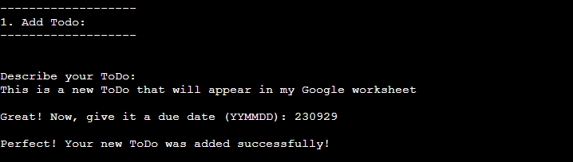
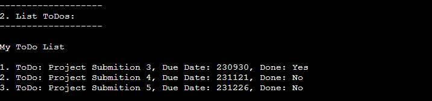
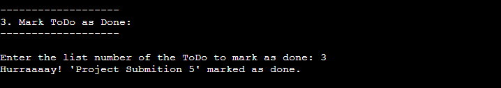

# My ToDo App

**My ToDo App** is a Python command-line application that helps you manage your ToDo list efficiently. It allows you to add a new task, list existing ones and mark a task as done. The app is connected to a Google spreadsheet that will be updated through user input in the CLI.


## Features

### 1. **Add ToDo**
   Add new task to your list with a description and a due date.
   

### 2. **List ToDos**
   View all tasks in your ToDo list including descriptions, due dates, and statuses.
   

### 3. **Mark ToDo as Done**
   Mark task as done, keeping track of your progress.
   


## Benefits

- **Efficient Task Management:** Stay organized by adding, viewing, and completing tasks from the command line.
- **Time Management:** Set due dates for tasks to prioritize your workload effectively.
- **Ease of Use:** Simple and intuitive interface, making task management quick and hassle-free.
- **Error Prevention:** Built-in validation and error handling ensure accurate input and prevent common mistakes.


## How to Use

1. **Clone the Repository:**
   ```bash
   git clone https://github.com/Pernilla-Strandberg/my-todo-app.git
   cd my-todo-app

2. **Install Dependencies:**
   ```bash
   pip install -r requirements.txt

3. **Run the Application:**
   ```bash
   python3 run.py

4. **Follow On-Screen Instructions:**
- From the menu, choose to add, list or mark tasks.
- Quit the app by select Quit from the menu.


## Testing

My ToDo App has been thoroughly tested using the **Trunk Check** extension for Visual Studio Code, ensuring reliable and error-free operation.


## Deployment

The application is deployed on GitHub and Heroku for easy access and usage.

- **GitHub Repository:** [https://github.com/Pernilla-Strandberg/my-todo-app.git](https://github.com/Pernilla-Strandberg/my-todo-app.git)
- **Heroku Deployment:** [https://my-todo-list-app-fb3d481c53c9.herokuapp.com/](https://my-todo-list-app-fb3d481c53c9.herokuapp.com/)


## Credits

Sources and additional information can be found in the docstrings within the codebase.